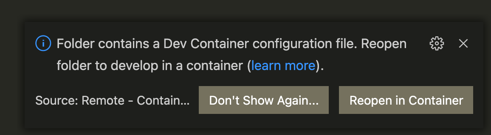

# Development Container

The Dockerfile in this directory creates a docker container with the necessary dependencies to build the book.
The container starts with a base Ubuntu 22.04 image and adds:

1. Utilities (curl, sudo, git, etc.)
1. LaTeX and XeXeX (used to create PDF)
1. Pandoc
1. Python3, Pip3, Panflute (used for filters)

## Visual Studio Code and a Remote Container

If you have the Remote Containers extension installed, when you open the repository, you will see the following message:

Click "Repen in Container" and docker will (assuming you are logged into Docker and a member of the VML organization) pull the image down and add necessary extensions.

## Building and Pushing the container

To accomodate multiple architectures this container file expects two arguments (ARCH and ARCHPKG). While you could manually build the continer, I've created a handy script that builds the container for arm64v8 and amd64 pushes those containers then creates a manifest including both architectures.

`./build.sh`

Make sure you run this command from your workstation and do not execute it inside of a container.

The build container is stored in VML's docker organization repository.
The docker repository is located at [vmlyr/monthly-report](https://hub.docker.com/repository/docker/vmlyr/monthly-report).

## Using the Container

You can pull this container from the docker repository by running this command:

` docker pull vmlyr/monthly-report:manifest-latest `

You may need to mount the local filesystem where the report is checked out.
If you have the Remote Containers [ms-vscode-remote.remote-containers](https://marketplace.visualstudio.com/items?itemName=ms-vscode-remote.remote-containers) add-in for Visual Studio Code, this extension handles that part automatically.
For more about Visual Studio Code and remote containers, visit [https://code.visualstudio.com/docs/remote/containers](https://code.visualstudio.com/docs/remote/containers).
