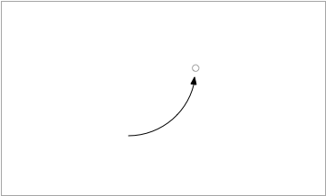
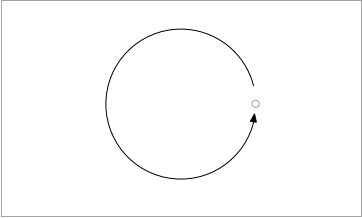
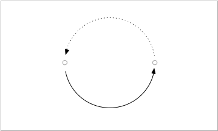
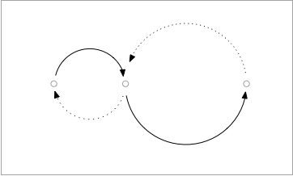
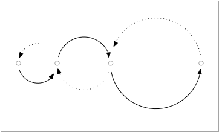
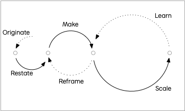
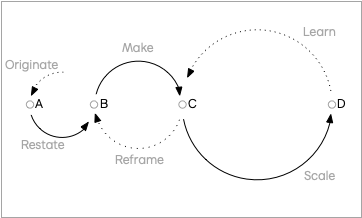

## Journey-Driven Agility

We practice agile software development every day. Fundamentally, we need an approach to generating feedback rapidly and iteratively, repeating these essential steps:

1. Pick a direction to go.
2. Take a step in that direction.
3. Evaluate progress and impact.

How might we embellish this high-level process using a journey-driven approach? Consider an ask from a client or customer. A common origin story is a request from a client to achieve a classic growth curve:

Our experience tells us that to get there we need to iterate. This idea of iteration is an ancient idea of infinite rebirth is often represented as an ouroboros, or snake eating its own tail:

Segmenting this iteration into delivery and feedback, we've modeled our 3 point list. The lower line is the next step and the feedback line is the evaluation. The checkpoints are the release and the evaluation. Pick a direction, take a step in the direction (delivery), then evaluate progress and impact (feedback) before the next action:

## Engineering

It can be this simple. You can layer in a variety of detailed methods. Consider a daily loop using Scrum. The left checkpoint is the daily scrum. The right checkpoint is the daily release. The solid line is the work from the backlog to the next release. The dotted line is the test feedback from the last release (returning us to the next daily scrum).

On the same Scrum team, each of these daily iterations would form a larger loop for the sprint. The left check point is the retrospective from the prior sprint. The right checkpoint is the demonstration at the end of the sprint. The dotted line is the feedback from the release and the work into the next retrospective. <!-- TODO To learn more about Scrum,  cite preferred scrum -->

On most projects there are many teams working on different parts of the project. Architectural boundaries make it possible to decompose large engineering projects into many smaller and more manageable teams. Other patterns emerge at scale with specialized teams for automation and developer experience (DevOps). <!-- TODO: link to DevOps --> 

## Design

Outside of engineering there is often a different kind of iterative loop happening on the product design teams. Feedback from launches can lead to a need to reconsider the direction of the product itself. This is often a different team entirely following a different process:

Think of the left circle as the product design process and the right circle as the engineering process. Since our book is concerned primarily with software development, we won't go into a lot of detail about this process. <!-- TODO: To learn more, cite 101 Design Methods -->

## Initiation

In our work with clients, we actually see an even earlier process that initiates this system of flywheels:

We call this diagram the sideways snowman. The circles increase in size as the initiation team tends to be small, the design team tends to be larger, and the engineering team tends to be the biggest (though none of these are to scale).

At this point, some labels may help:

Note that most projects will iterate differently but the simplest path might be:

1. Originate
2. Restate
3. Make
4. Scale

You might then loop on Learn and Scale for a while before returning to Reframe. The Reframe/Make loop usually runs independent of the Scale/Learn loop. It is even possible that the outcome of Reframing a problem will so reset expectations that you return to Originate though that is infrequent enough that we don't show that as connected.

Adding in the checkpoints, we have this complete diagram:

<!-- 
See also:

1. Scrum
2. [Leading Lean Software Development: Results Are not the Point]()

-->
